# Healthy - Healthy Recipes community

<br>

## CONTENTS

* [Introduction](#introduction)
* [User Experience UX](#user-experience-ux)
    * [User Stories](#user-stories)
    * [Design](#design)
        * [Colours](#colours)
        * [Fonts](#fonts)
        * [Wireframes](#wireframes)
* [Agile Methodology](#agile-methodology)
* [Features](#features)
    * [Home Page](#home-page) 
    * [Account Section](#account-section)
    * [Dinner, Sweets, Coctailes Pages](#dinner-sweets-coctailes-pages)
    * [Recipe Details Page](#recipe-details-page)
    * [Add Recipe Page](#add-recipe-page) 
    * [Profile Dropdown Menu](#profile-dropdown-menu)
    * [Future Feature](#future-feature)
* [Full Testing](#full-testing)
* [Technologies Used](#technologies-used)
    * [Languages](#languages)
    * [Frameworks and Software](#frameworks-and-software)
    * [Libraries](#libraries)
* [Deployment](#deployment)
    * [Forking this Project](#forking-this-project)
    * [Cloning this Project](#cloning-this-project)
* [Credits](#credits)
    * [Contents](#contents)
    * [Resources](#resources)
* [Acknowledgements](#acknowledgements)

## Introduction

Healthy website is a social media platform for healthy cooking recipes. Users are able to share their own healthy recipes with others. This social platform targets users who are interested in healthy cooking recipes. Each user has the ability to share a post with a recipe title, ingredients and recipe directions so others can apply it easily. Users are given the ability also to like, leave comments and bookmarks others recipes.

The fully deployed project can be accessed at [Here](https://pp4-yummy-d1fe3ffd7115.herokuapp.com/)


## User Experience UX

### User Stories

|     EPIC               | User Story |
|     ---                |     ---    |
|  **User Navigation**      | As a user I can view a navbar from every page so that I can navigate easily between pages|
|                        | As a logged out user I can see sign in and sign up options so that I can sign in/sign up|
|                        | As a user I can navigate through pages quickly so that I can view content seamlessly without page refresh |
|                        | As a user I can view user's avatars so that I can easily identify users of the application                                         
|  **User Authentication**    | As a user I can create a new account so that I can access all the features for signed up users |
|                        | As a user I can sign in to the app so that I can access functionality for logged in users |
|                        | As a user I can tell if I am logged in or not so that I can log in if I need to |
|                        | As a user I can maintain my logged-in status until I choose to log out so that my user experience is not compromised |
|  **Profile Management**  | As a user I can view basic profile information so that I can check user prfile page |
|                         | As a user I can see a list of the most followed profiles so that I can see which profiles are popular | 
|                         | As a user I can view statistics about a specific user: bio, number of posts, follows and users followed so that I can learn more about them |
|                          | As a logged in user I can follow and unfollow other users so that I can see and remove posts by specific users in my posts feed|
|                          | As a user I can view all the posts by a specific user so that I can catch up on their latest posts, or decide I want to follow them|
|                          | As a logged in user I can edit my profile so that I can change my profile picture and bio|
|                          | As a logged in user I can update my username and password so that I can change my display name and keep my profile secure|
|    **Recipes Management**  | As a logged in user I can create recipes so that I can share my healthy recipes with the world!|
|                          | As a user I can view the details of a single recipe so that I can learn more about it|
|                          | As a logged in user I can like a recipe post so that I can show my support for the recipes that interest me|
|                    | As a user I can view all the most recent recipes, ordered by most recently created first so that I am up to date with the newest one|
|                    | As a user I can search for recipes with keywords so that I can find the recipes and user profiles I am most interested in. |
|                    | As a logged in user I can view the recipes I liked so that I can find the recipes I enjoy the most |
|                    | As a logged in user I can view content filtered by users I follow so that I can keep up to date with what they are posting about |
|                    | As an owner of a comment I can delete my comment so that I can control removal of my comment from the application |
|                    | As an owner of a comment I can edit my comment so that I can fix or update my existing comment |
|                    | As a logged in user I can save a recipe post so that I can show my show it when i need. |
|                    | As a logged in user I can view the recipes I have bookmarked so that I can find the recipes I enjoy the most |
|   **Users Contacts**   | As a user, I would like to be able to contact the admin so that I can send any issues or suggestions  |

[Back to top](<#contents>)

### Design

#### Colours
* The colour scheme was used in the project based on blue color and its shades.White color for main background for each div component, light blue for the main background, dark blue for nav links and headers. It is a great light shade and suitable for the text in which for creating a good contrast. 


#### Fonts
* The fonts I used for the site were imported from [Google Fonts](https://fonts.google.com/):<br>
**Body,** *Alegreya, cursive, serif*<br>
**Navbar:** *Alegreya, cursive, sans-serif*<br>


#### Wireframes
* The wireframes for desktop and mobile were created with [Balsamiq](https://balsamiq.com/) 

<details>

<summary>Home Page</summary>

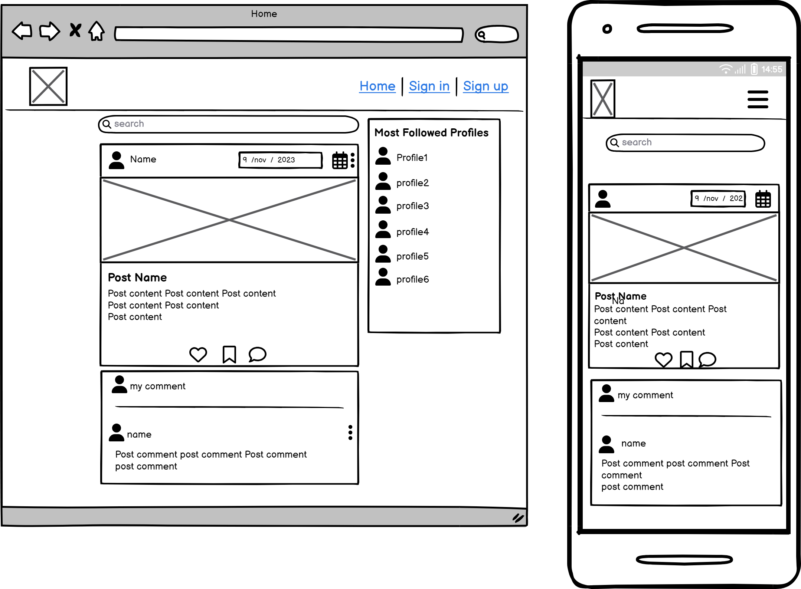
</details>

<details>

<summary>Feed Page</summary>

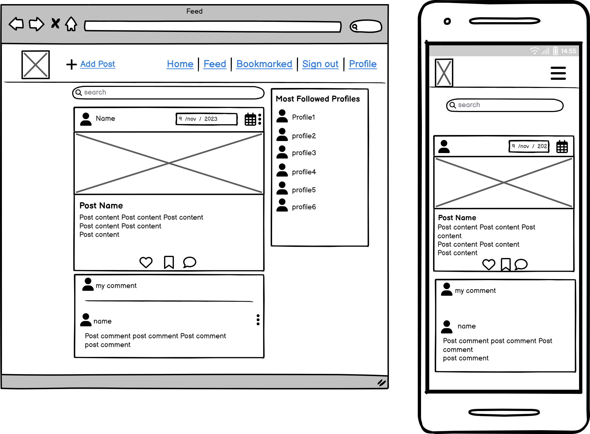
</details>

<details>

<summary>Bookmark page</summary>

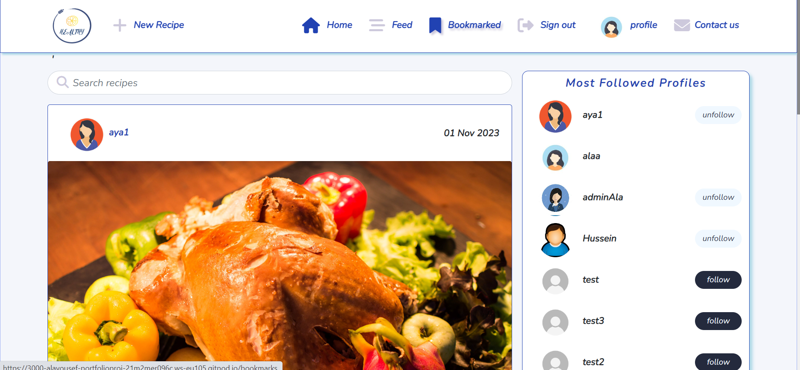
</details>

<details>

<summary>Profile page</summary>

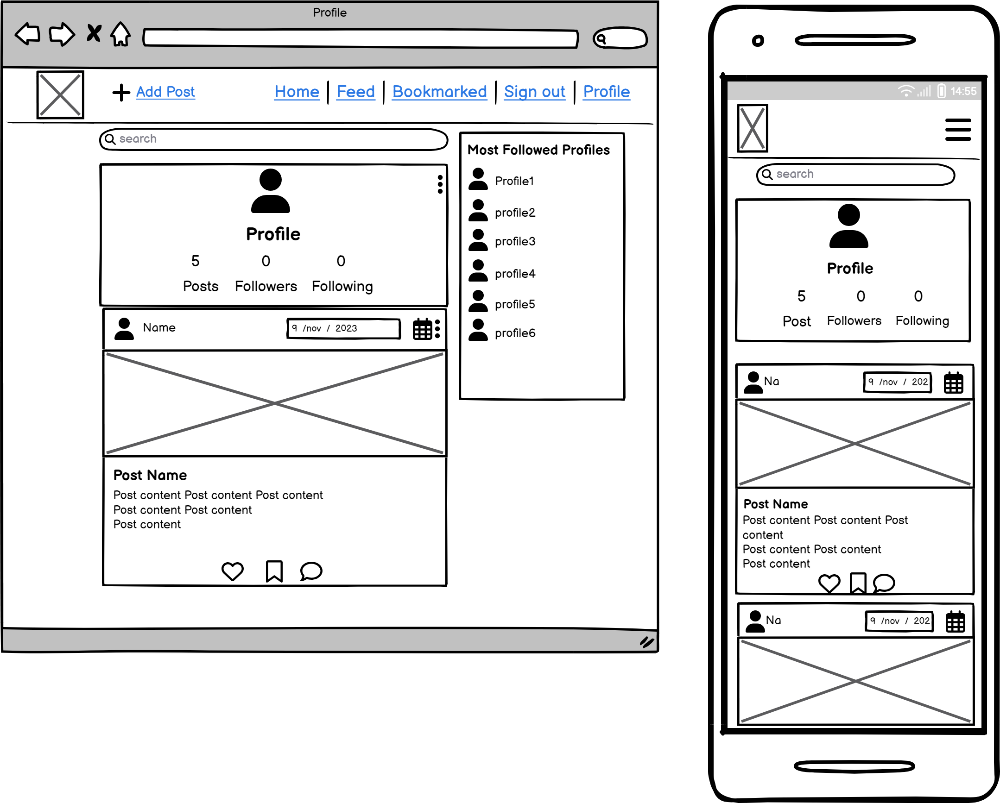
</details>


<details>

<summary>Edit Profile</summary>

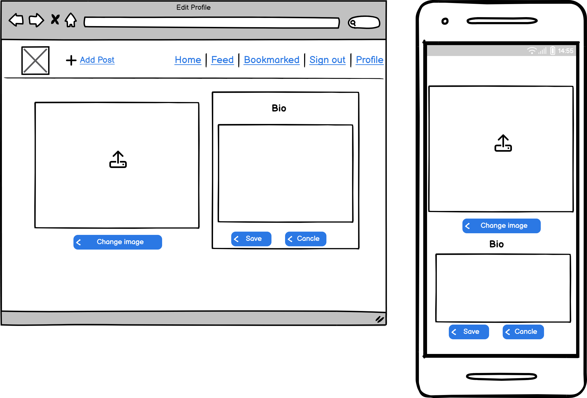
</details>

<details>

<summary>Add recipe </summary>

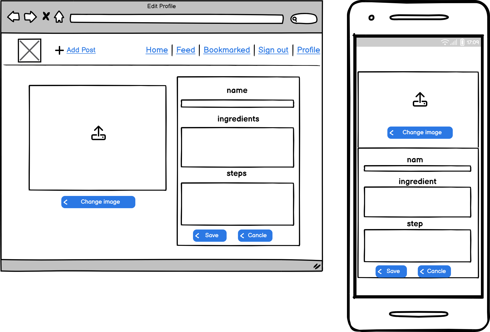
</details>

<details>

<summary>Edit recipe </summary>

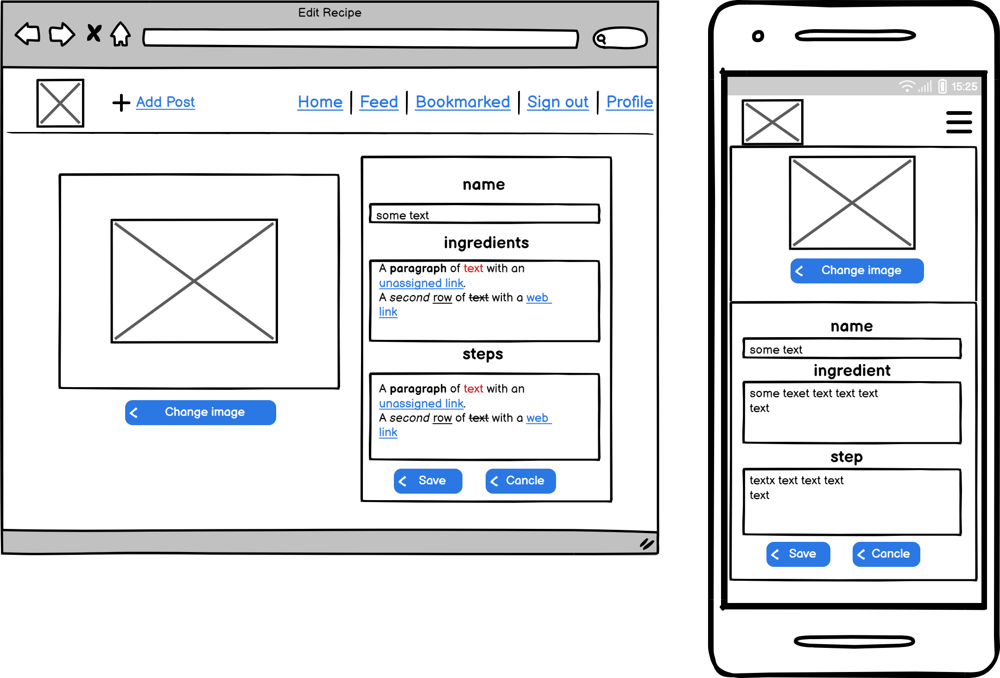
</details>

<details>

<summary>Sign in</summary>

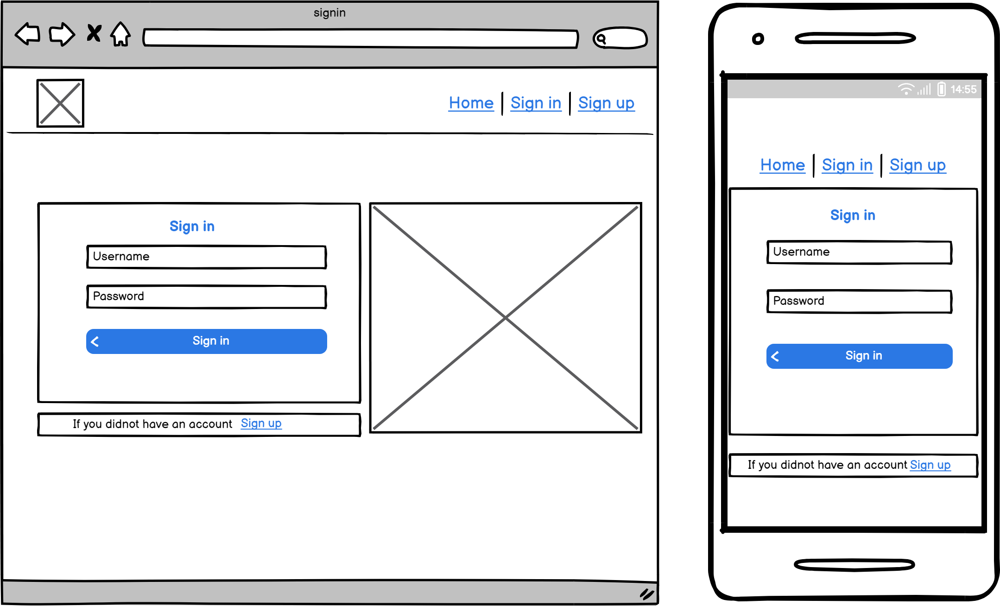
</details>

<details>
<summary>Sign up </summary>

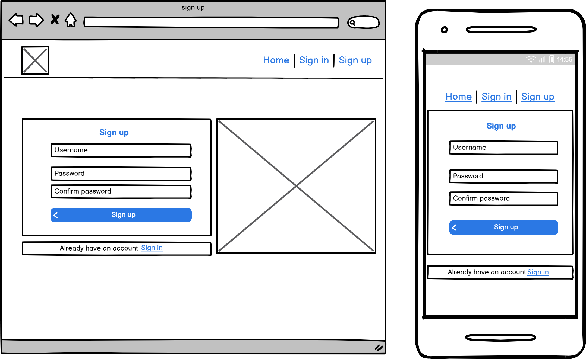
</details>

<details>
<summary>Contact us </summary>

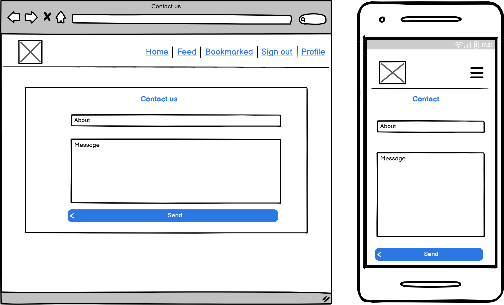
</details>


[Back to top](<#contents>)


## Logic

### Flowcharts 
This is the flowchart diagram for my website, represent how the system work step by step. The charts were generated using [Lucidchart](https://lucid.app/) <br>

<br>

### Database Design

<br>


[Back to top](<#contents>)

## Agile Methodology
The project was developed using the Agile methodology. Product backlog is detailed into three levels:<br>
* Epics which is a large quantities of related work, which were five epics for the project. Each of them has a list of features.
* A feature, is a service that delivers value to the end user. 
* Each feature is broken down into a number simpler tasks which are user stories. 

As the user stories were achieved, they were moved from To Do list, to In-Progress, and finally Done lists. You can have a look to the project board [here](https://github.com/users/AlaYousef/projects/4/views/1?layout=board)

<details>
<summary>Sprints Details</summary>

* **Sprint 1 - SETTING-UP**<br>
    -Setup Django<br>
    -Deploy on heroku<br><br>
* **Sprint 2 - SITE MANAGEMENT**<br>
    -Building The Admin Site<br><br>
* **Sprint 3 - NAVIGATION**<br>
    -Create a navigation menu<br>
    -Add website logo, nav menue<br>
    -Choose fonts, colors and background images <br><br>
* **Sprint 4 - RECIPE INTERACTION**<br>
    -Create recipe, comment models<br>
    -Create Recipes list view and recipe detail view.<br>
    -Return to Sprint 3, Implement pagenation.<br><br>
* **Sprint 5 - USER PROFILE**<br>
    -Implement *Register*, *Login* and *Logout* pages with forms using the django-allauth module.<br>
    -Return to Sprint 4, Implement *Like*, *bookmark* and *comment* features.<br>
    -Implement form for adding and updating recipes<br>
    -Create *bookmarked* and *my recipes* pages.<br>
    -Return to Sprint 4, Implement *delete* comment feature.<br><br>

</details><br><br>

[Back to top](<#contents>)

## Features
### Home Page
* Home page contain a welcome message for logged-in users with short description about the website will appear. 
* Three recipes cards with three different categories will displayed. When the user click on one of it , will navigate to recipe list of the specific category.
* Recent recipes will appear also at the end of the home page. On click the user clicked will navigate to the specific recipe details page.
* Top arrow, an arrow appears at the end of the page to return back to the top of the home page for ease of navigation for users. 

<br>

#### Header

* Logo with site name positioned in the top left of the header section. This logo is linked to the home page to facilitate navigation for users. <br>
* The navigation bar displayed at the right top of header section includes all links to the various other pages.
* When the user logged in, profile and add-recipe links added to the navigation bar. In addnition to log-out instead of log-in/register.
* The navigation bar is fully responsive, collapsing into a hamburger on small screen sizes.<br>

<br><br>


#### Footer

* The footer section includes links to social media, Facebook, Twitter, Instagram and Youtube.
* Each of these links opens a separate tab on clicking to keep accessibility and stay consistent, so users know what to expect when they are navigating through the website.

<br>

[Back to top](<#contents>)


### Account Section
* Registration, log in and log out are implemented using Django allauth library.

#### Register Page
* To register an account, users required to enter uersname, email, password and password confirmation.
* After all information entered correctly the user will redirect to the Home page with a confirmation message "Successfully signed in as (user name)".

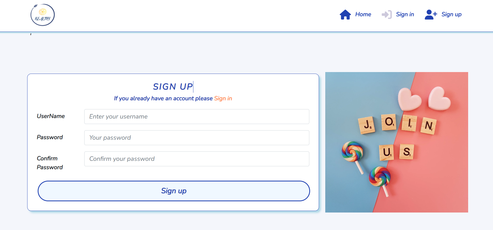<br>

<br><br>

#### Log-in Page
* Users is required to enter username and password to log in.
* After the user enter the required information, the user will redirect to the home page with a confirmation message "Successfully signed in as (user name)".
* Once the user logged in, new links in navigation bar will appear; _Add Recipe_, _Profile_ and _Log out_.
<br>

* Log in confirmation message.
<br><br>

#### Log-out Page
* The user asked "Are you sure you want to log out?".
* User will redirect to the _Home_ page if the user click _yes_.

<br><br>

* Log out confirmation message.
<br>


### Dinner, Sweets, Coctailes Pages
 * Each of these tabs are linked to a page with list of recipes which only contain recipes within the specific category. 
 * Each of these pages has a pagination to divide the content into separate pages. The page contain max 6 recipes cards and the rest are appears in the next page. So users can navigate to them using next button and return back using previous button.

<br><br>

### Recipe Details Page
#### Recipe information 

* If the user click on any recipe name for different categories, the user will navigate to the recipe detail page.
* This page conatin all information that the user need for the recipe. Including recipe name, author, cooking/preparing time, Ingredients and steps to apply this recipe.
* Logged-in users can save this recipe in his own profile by bookmark this recipe throw this icon 
 .
* In addition, users can like or dislike the recipe throw the icon . When like, the number of likes for this recipe will increases.  

 <br><br>

#### Comments Section 
* The website is interactive so logged-in users can leave comments on a specific recipe.
* These comments must be approved by the site admin to be published.
* Logged-in user can delete his own comment if needed by clicking on this icon  beside the author name, and only the comment author can do that.  

<br>

* If this Icon clicked, the user will be asked _Are you sure you want to delete this comment?_. If _Yes_ is clicked the comment will deleted and the user will stay in recipe details page. 

<br><br>

[Back to top](<#contents>)


### Add Recipe Page
* Users can interact with the website by adding their own recipes and this after registrering an account.
* User required to fill the form correctly and click _submit_ button. If the user enter incorrect valid the user will be required to fill the correct values.
* Each of time, min/hour fields are drop down so the user can select the time and click to choose if it in minutes or hours. 
* The recipe will be published in his name, at the same time saved in _my recipes_ tab.

 <br>

* Confirmation message will be displayed to confirm the user that the recipe is successfully added.
 <br><br>
 
[Back to top](<#contents>)

### Profile Dropdown Menu
<br><br>

#### My Bookmarkes page
* All bookmarkes recipes that the user bookmarked will be saved in this page. So, user can return to them any time he want. It's like a digital cookbook.
 <br><br>
 
* Confirmation message will be displayed after the user click on bookmark button to confirm the user that recipe added successfully to bookmarkes page.
<br><br>

#### My Recipes page
* All recipes that the user has created will be saved in this page.
* The user can mange these recipes by _Delete_ or _Edit_ these recipes.
 <br>
* If the user decide to delete the recipe, the user will get delete confirmation to insure that the user want to delete the recipe, If _yes_ is clicked the recipe will deleted and removed from publishing and sure from this page.
<br>
* If the user want to update his own recipe in some way, can doing that by click _Edit Recipe_ link. The user will redirect to the add recipe form  again, update it and click submit.
<br><br>


[Back to top](<#contents>)

### Future Feature
These user stories are labelled as "Wont Have" in Github, due to time constraints and will be implemented later.

#### Add Breadcrumb User Story
* _As a site user I can see navigation path of the page** so that I know where I am and navigate easy_

* Users can easily know which page he is on and return back easily by adding links at the top of each page in hierarchical structures.

#### Sort Recipes User Story
* _As a Site User I can sort my bookmarked recipes in my profile so that I can find the most favourite one easily._

* In my bookmarkes page, recipes will sorted from the most preffered one to least.

## Full Testing
The testing documentation can be found at [TESTING.md](TESTING.md)

[Back to top](<#contents>)


## Technologies Used
### Languages

* [Python](https://en.wikipedia.org/wiki/Python_(programming_language)) - Provides The site functionality.
* [HTML5](https://en.wikipedia.org/wiki/HTML) - Provides site content and structure.
* [CSS3](https://en.wikipedia.org/wiki/CSS) - Provide the website styling.
* [JavaScript](https://en.wikipedia.org/wiki/JavaScript) - Provides interactivity with site elements.

### Frameworks & Software
* [Bootstrap](https://getbootstrap.com/) - Bootstrap is a free and open-source CSS framework directed at responsive, mobile-first front-end web development.
* [Django](https://www.djangoproject.com/) - A model-view-template framework used to Yummy Recipes website.
* [Balsamiq](https://balsamiq.com/) - The Tool that used to create the wireframes.
* [Github](https://github.com/) - Used to host and edit the website.
* [Gitpod](https://www.gitpod.io) - The  development environment that used for the wesite development.
* [Heroku](https://en.wikipedia.org/wiki/Heroku) - A cloud platform that that used to deploy the application.
* [Lighthouse](https://developer.chrome.com/docs/lighthouse/overview/) - Used to test performance, accessibility  of site.
* [a11y Color Contrast Accessibility Validator](https://color.a11y.com/Contrast/) - Used to test color contrast on the website.
* [Lucidchart](https://www.lucidchart.com/) - Used to create logical chart for the project.
* [Favicon](https://favicon.io/) - Used to create the favicon.
* [Google Chrome DevTools](https://developer.chrome.com/docs/devtools/) - Used to test responsiveness.
* [Cloudinary](https://cloudinary.com/) - A service that hosts all images in the project.
* [HTML Validation](https://validator.w3.org/) - Used to validate HTML code
* [CSS Validation](https://jigsaw.w3.org/css-validator/) - Used to validate CSS code
* [PEP8 Validation](http://pep8online.com/) - At the time for deploying this project the PEP8 Online Validaton service was offline, therefore not used.
* [JSHint Validation](https://jshint.com/) - Used to validate JavaScript code

### Libraries
All libraries used for this project are listed in the requirements.txt file and have been documented below:

* [asgiref](https://pypi.org/project/asgiref/) - ASGI is a standard for Python asynchronous web apps and servers to communicate with each other, and positioned as an asynchronous successor to WSGI.
* [cloudinary](https://pypi.org/project/cloudinary/) - The Cloudinary Python SDK allows you to quickly and easily integrate your application with Cloudinary. Effortlessly optimize, transform, upload and manage your cloud's assets.
* [dj-database-url](https://pypi.org/project/dj-database-url/) - Django database connection dictionary, populated with all the data specified in your URL.
* [dj3-cloudinary-storage](https://pypi.org/project/dj3-cloudinary-storage/) - Django Cloudinary Storage is a Django package that facilitates integration with Cloudinary by implementing Django Storage API.
* [Django](https://pypi.org/project/Django/) - Django is a high-level Python web framework that encourages rapid development and clean, pragmatic design.
* [django-allauth](https://pypi.org/project/django-allauth/) - Integrated set of Django applications addressing authentication, registration, account management as well as 3rd party (social) account authentication.
* [django-crispy-forms](https://pypi.org/project/django-crispy-forms/) - Used to integrate Django DRY forms in the project.
* [django-summernote](https://pypi.org/project/django-summernote/) - Summernote is a simple WYSIWYG editor. django-summernote allows you to embed Summernote into Django very handy. Support admin mixins and widgets
* [gunicorn](https://pypi.org/project/gunicorn/) - Gunicorn ‘Green Unicorn’ is a Python WSGI HTTP Server for UNIX. It’s a pre-fork worker model ported from Ruby’s Unicorn project. The Gunicorn server is broadly compatible with various web frameworks, simply implemented, light on server resource usage, and fairly speedy.
* [oauthlib](https://pypi.org/project/oauthlib/) - OAuthLib is a framework which implements the logic of OAuth1 or OAuth2 without assuming a specific HTTP request object or web framework.
* [psycopg2](https://pypi.org/project/psycopg2/) - Psycopg is the most popular PostgreSQL database adapter for the Python programming language.
* [PyJWT](https://pypi.org/project/PyJWT/) - A Python implementation of RFC 7519.
* [python3-openid](https://pypi.org/project/python3-openid/) - OpenID support for modern servers and consumers.
* [requests-oauhlib](https://pypi.org/project/requests-oauthlib/) - P    rovides first-class OAuth library support for Requests.
* [sqlparse](https://pypi.org/project/sqlparse/) - sqlparse is a non-validating SQL parser for Python. It provides support for parsing, splitting and formatting SQL statements.
* [urllib3](https://pypi.org/project/urllib3/) a powerful, user-friendly HTTP client for Python brings many critical features that are missing from the Python standard libraries:


[Back to top](<#contents>)

## Deployment

The project was deployed to [Heroku](https://www.heroku.com). To deploy, please follow these steps:

1. To begin with we need to create a GitHub repository from the [Code Institute template](https://github.com/Code-Institute-Org/gitpod-full-template) by following the link and then click 'Use this template'.


2. Fill in the needed details as stated in the screenshot below and then click 'Create Repository From Template'.

3. When the repository creation is done click 'Gitpod' as stated in the screenshot below.


4. Now it's time to install Django and the supporting libraries that are needed. Type the commands below to do this.

* ```pip3 install 'django<4' gunicorn```
* ```pip3 install 'dj_database_url psycopg2```
* ```pip3 install 'dj3-cloudinary-storage```

5. When Django and the libraries are installed we need to create a requirements file.

* ```pip3 freeze --local > requirements.txt``` - This will create and add required libraries to requirements.txt


6. Now it's time to create the project.

* ```django-admin startproject YOUR_PROJECT_NAME .``` - This will create your project

7. When the project is created we can now create the application.

* ```python3 manage.py startapp APP_NAME``` - This will create your application


8. We now need to add the application to settings.py

8. Now it is time to do our first migration and run the server to test that everything works as expected. This is done by writing the commands below.

* ```python3 manage.py migrate``` - This will migrate the changes
* ```python3 manage.py runserver``` - This runs the server. To test it, click the open browser button that will be visible after the command is run.

9. Now it is time to create our application on Heroku, attach a database, prepare our environment and settings.py file and setup the Cloudinary storage for our static and media files.

* Head on to [Heroku](https://www.heroku.com/) and sign in (or create an account if needed).

* In the top right corner there is a button that is labeled 'New'. Click that and then select 'Create new app'.

10. Now it's time to enter an application name that needs to be unique. When you have chosen the name, choose your region and click 'Create app".

11. To add a database to the app you need to go to the resources tab ->> add-ons, search for 'Heroku Postgres' and add it.

12. Go to the settings tab and click on the reveal Config Vars button. Copy the text from DATABASE_URL (because we are going to need it in the next step).

13. Go back to GitPod and create a new env.py in the top level directory. Then add these rows.

* ```import os``` - This imports the os library
* ```os.environ["DATABASE_URL_FROM HEROKU"]``` - This sets the environment variables.
* ```os.environ["SECRET_KEY"]``` - Here you can choose whatever secret key you want.


14. Now we are going to head back to Heroku to add our secret key to config vars. See screenshot below.


15. Now we have some preparations to do connected to our environment and settings.py file. In the settings.py, add the following code:

```import os```

```import dj_database_url```

```if os.path.isfile("env.py"):```

```import env```


16. In the settings file, remove the insecure secret key and replace it with:
```SECRET_KEY = os.environ.get('SECRET_KEY')```

17. Now we need to comment out the old database setting in the settings.py file (this is because we are going to use the postgres database instead of the sqlite3 database).


Now, add the link to the DATABASE_URL that we added to the environment file earlier.

18. Save all your fields and migrate the changes.

```python3 manage.py migrate```

19. Now we are going to get our connection to Cloudinary connection working (this is were we will store our static files). First you need to create a Cloudinary account and from the Cloudinary dashboard copy the API Environment Variable.

20. Go back to the env.py file in Gitpod and add the Cloudinary url (it's very important that the url is correct):

```os.environ["CLOUDINARY_URL"] = "cloudinary://************************"```

21. Let's head back to Heroku and add the Cloudinary url in Config Vars. We also need to add a disable collectstatic variable to get our first deployment to Heroku to work.

22. Let's head back to our settings.py file on Gitpod. We now need to add our Cloudinary Libraries we installed earlier to the installed apps. Here it is important to get the order correct.


23. For Django to be able to understand how to use and where to store static files we need to add some extra rows to the settings.py file.

24. Hang in there, we have just a couple of steps left. Now it's time to link the file to the Heroku templates directory.

25. Let's change the templates directory to TEMPLATES_DIR in the teamplates array.


26. To be able to get the application to work through Heroku we also need to add our Heroku app and localhost to which hosts that are allowed.


27. Now we just need to add some files to Gitpod.

* Create 3 folders in the top level directory: **media**, **static**, **templates**
* Create a file called **Procfile* and add the line ```web: gunicorn PROJ_NAME.wsgi?``` to it.

28. Now you can save all the files and prepare for the first commit and push to Github by writing the lines below.

* ```git add .```
* ```git commit -m "Deployment Commit```
* ```git push```

29. Before moving on to the Heroku deployment we just need to add one more thing in the config vars. We need to add "PORT" in the KEY input field and "8000" in the VALUE field. If we don't add this there might be problems with the deployment.

30. Now it's time for deployment. Scroll to the top of the settings page in Heroku and click the 'Deploy' tab. For deployment method, select 'Github'. Search for the repository name you want to deploy and then click connect.

31. Scroll down to the manual deployment section and click 'Deploy Branch'. Hopefully the deployment is successful!

The live link to the 'Yummy' site on Heroku can be found [here](https://pp4-yummy-d1fe3ffd7115.herokuapp.com/). And the Github repository can be found [here](https://github.com/AlaYousef/portfolio-project4).

[Back to top](<#table-of-content>)

### How To Fork 

It is possible to do a independent copy of a GitHub Repository by forking the GitHub account. The copy can then be viewed and it is also possible to do changes in the copy without affecting the original repository. To fork the repository, take these steps:

1. After logging in to GitHub, locate the repository. On the top right side of the page there is a 'Fork' button. Click on the button to create a copy of the original repository.
<br><br>

[Back to top](<#table-of-content>)

### Cloning this Project.

To clone and set up this project follow these steps:

1. When you are in the repository, find the code tab and click it.
2. To the left of the green GitPod button, press the 'code' menu. There you will find a link to the repository. Click on the clipboard icon to copy the URL.
3. Use an IDE and open Git Bash. Change directory to the location where you want the cloned directory to be made.
4. Enter the command git clone followed by the copied URL
5. Your clone was created.


5. To be able to get the project to work you need to install the requirements. This can be done by using the command below:

* ```pip3 install -r requirements.txt``` - This command downloads and install all required dependencies that is stated in the requirements file.

6. The next step is to set up the environment file so that the project knows what variables that needs to be used for it to work. Environment variables are usually hidden due to sensitive information. It's very important that you don't push the env.py file to Github (this can be secured by adding env.py to the .gitignore-file). The variables that are declared in the env.py file needs to be added to the Heroku config vars which are ```os.environ["DATABASE_URL"]```, ```os.environ["CLOUDINARY_URL"]```, ```os.environ["SECRET_KEY"]``` . Don't forget to do necessary migrations before trying to run the server.

* ```python3 manage.py migrate``` - This will do the necessary migrations.
* ```python3 manage.py runserver``` - If everything i setup correctly the project is now live locally.


[Back to top](<#contents>)

## Credits

### Content
* All recipes content and details was taken from this recipes website [Delish](https://www.delish.com/)

### Resources
* Agile methodology inspired from [Knowledgehut](https://www.knowledgehut.com/blog/agile/features-in-agile-methodology).

* Bug number 1 in testing; for messages does not display after editing or deleting fixed by inspiration from [stackoverflow](https://stackoverflow.com/questions/24822509/success-message-in-deleteview-not-shown).

* Website design inspired from this [project](https://italianissimo-booking-website.herokuapp.com/).

* Deployment section in Readme file was taken from this [repository](https://github.com/worldofmarcus/project-portfolio-4/blob/main/README.md). It was so clear and easy to follow so I take it as is.

* Readme documentation template inspired from these repositories [repository1](https://github.com/useriasminna/italianissimo-booking-website/tree/main) and [repository2](https://github.com/worldofmarcus/project-portfolio-4/blob/main/README.md).

* User stories inspired from [Code Institute: I Think Therefore I Blog](https://learn.codeinstitute.net/courses/course-v1:CodeInstitute+FST101+2021_T1/courseware/b31493372e764469823578613d11036b/fe4299adcd6743328183aab4e7ec5d13/?child=last) and from this [repository](https://github.com/AliOKeeffe/PP4_My_Meal_Planner/tree/main).


* Bugs number 9; delete comment recipes was fixed by inspiration from [stackoverflow](https://stackoverflow.com/questions/14170473/get-absolute-url-in-django-when-using-class-based-views)

### Code

* Code of creating models, views and forms was inspired from [Code Institute: I Think Therefore I Blog](https://learn.codeinstitute.net/courses/course-v1:CodeInstitute+FST101+2021_T1/courseware/b31493372e764469823578613d11036b/09e0a94c7dbd4b969b8358a0cf5660b2/).

* Code help for deleting/adding recipes is from this youtube tutorials [Learn Django Class Based Views](https://www.youtube.com/watch?v=nW-srV0kKKk).


[Back to top](<#contents>)

## Acknowledgements
This App was completed as a Portfolio Project 4 for the Full Stack Software Developer Diploma at the [Code Institute](https://codeinstitute.net/). I would like to thank my mentor [Precious Ijege](https://www.linkedin.com/in/precious-ijege-908a00168/), the Slack community and specially tutor support. And all at the Code Institute for their help.

[Back to top](<#contents>)

---------------------------------------------------

resources
*React notification
https://dev.to/adyasha8105/react-notifications-33do


# Bugs 
2. "scripts": {
    "start": "react-scripts --openssl-legacy-provider start",
    "build": "react-scripts --openssl-legacy-provider build",
    }

3. warning findDOMnODE
SOL : delete  <React.StrictMode>
# Getting Started with Create React App

4. POST unutherized
install jwt-decoded

5. Attempted import error: 'jwt-decode' does not contain a default export (imported as 'jwtDecode').
sol: import * as jwt_decode from 'jwt-decode';
This project was bootstrapped with [Create React App](https://github.com/facebook/create-react-app).
