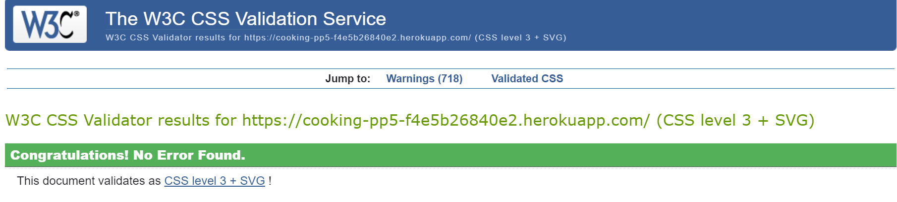
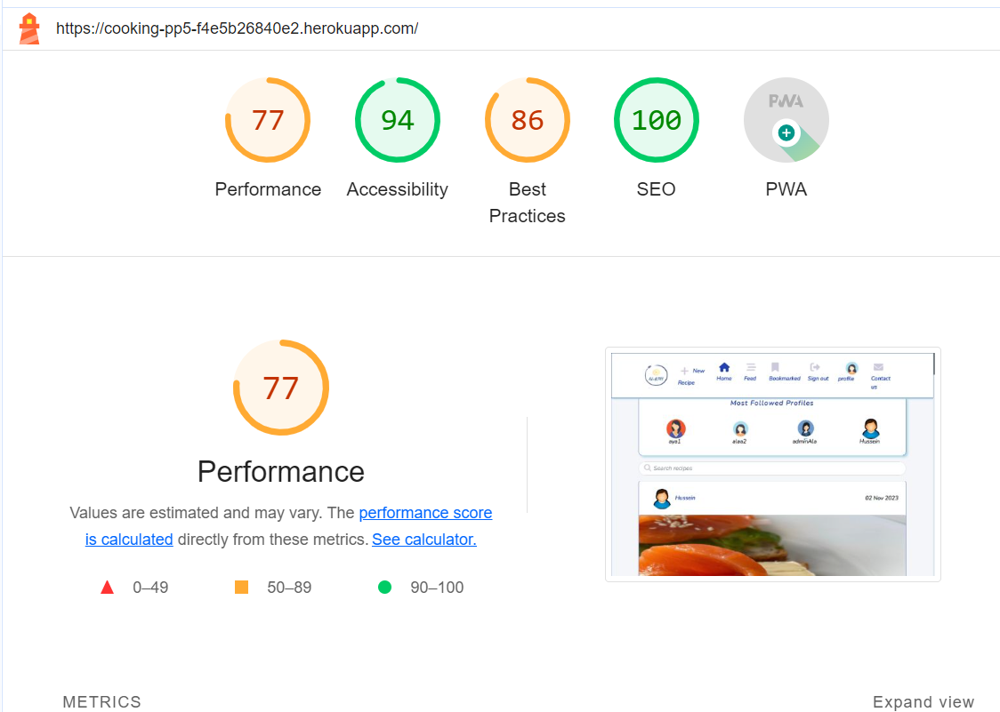
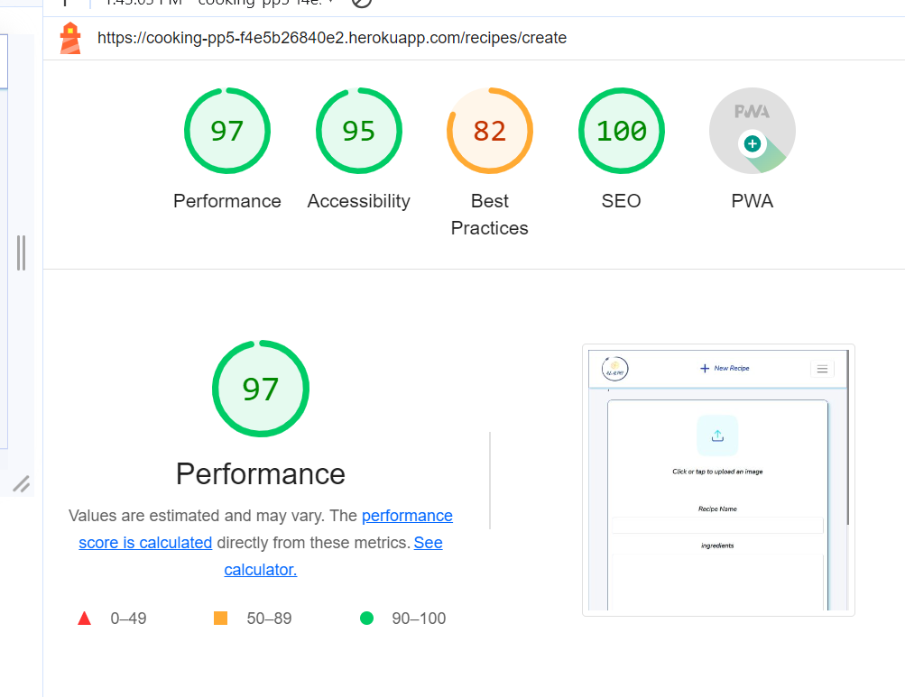
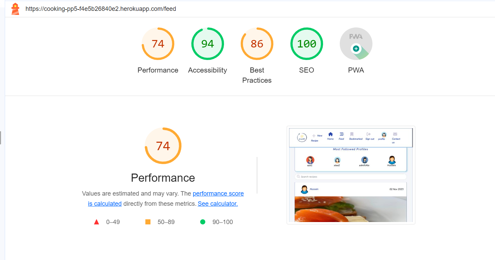
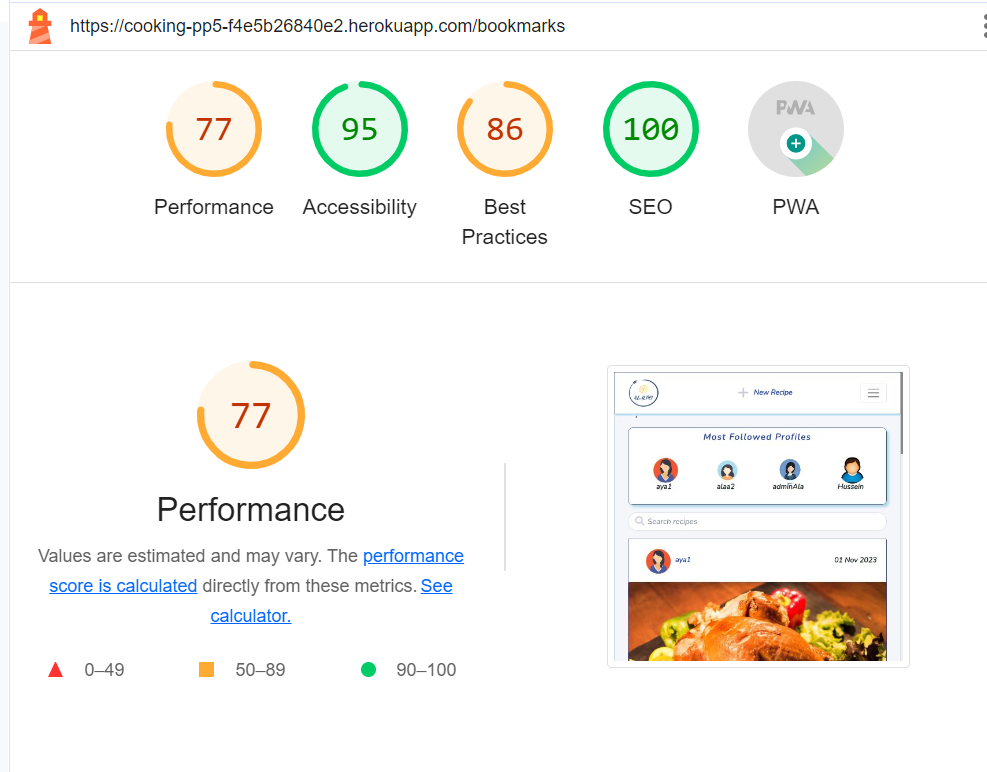
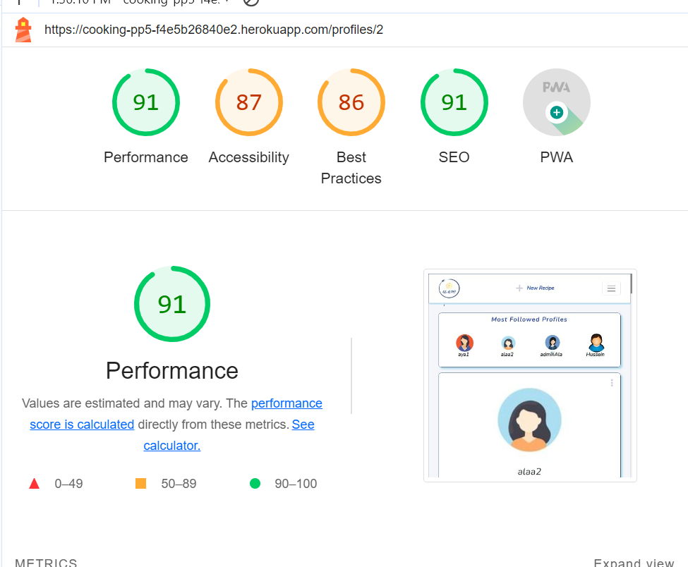
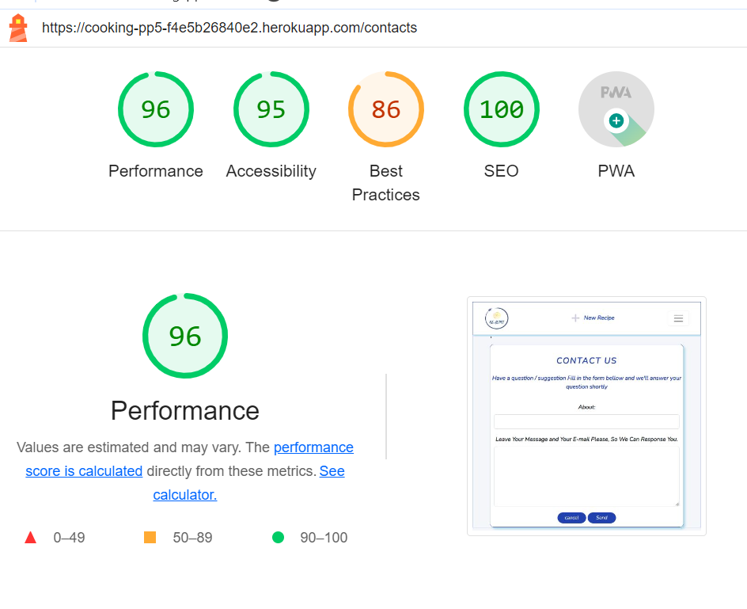
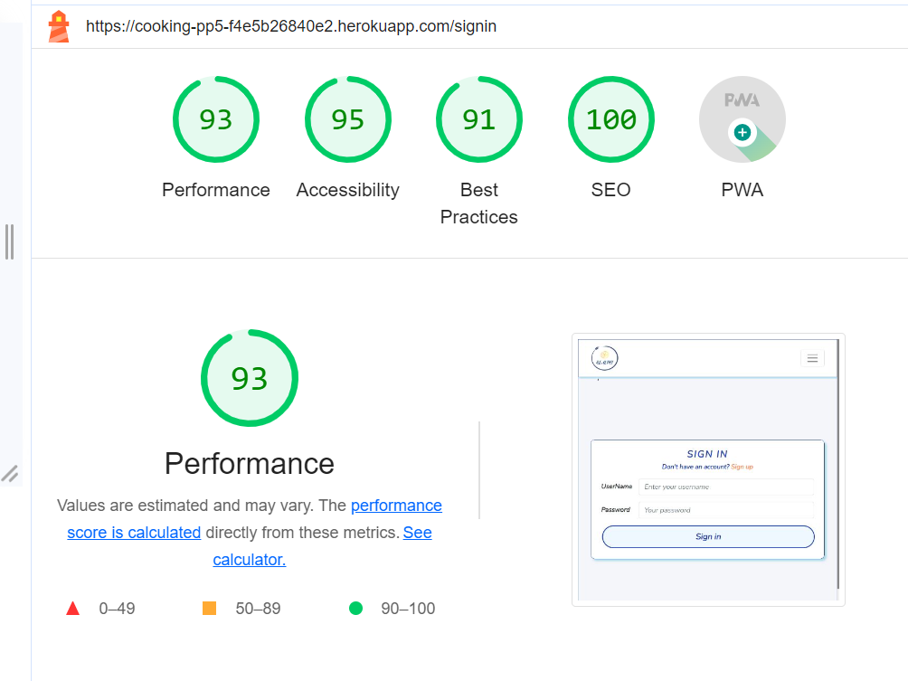
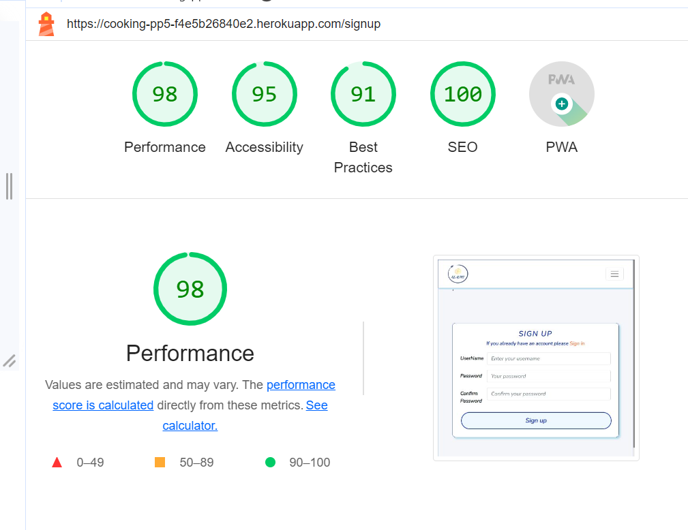
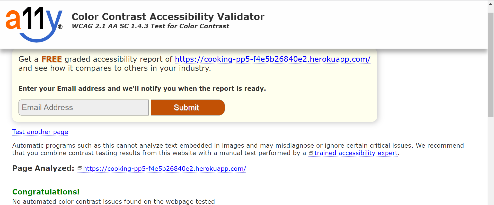

# Testing

Back to [README.md](README.md) 

## Table of contents
* [User Story and Feature Testing](#user-story-and-feature-testing)
* [Manuall Test](#manuall-test)
* [Code Validation](#code-validation)
* [Browser Testing](#browser-testing)
* [Responsiveness Tes](#responsiveness-test)
* [LightHouse](#lighthouse)
* [A11y Color Contrast Accessibility Validator](#a11y-color-contrast-accessibility-validator)
* [Bugs](#bugs)

## User Story and Feature Testing
### User Stories Testing

|     EPIC               | User Story |    Expected            | Pass / Fail  |
|     ---                |     ---    |     ---------------------------------                |     ---    |
|  **User Navigation**      | As a user I can view a navbar from every page so that I can navigate easily between pages|       Navigation bar is visible on every page of the website and fully responsive on different screen sizes         |    Pass  |
|                        | As a logged out user I can see sign in and sign up options so that I can sign in/sign up|Sign in / Sign up navlinks displayed on the navbar for logged out users        |     Pass  |
|                        | As a user I can navigate through pages quickly so that I can view content seamlessly without page refresh |Each navlink redirect to the expected page without any problems               |     Pass    |
|                        | As a user I can view user's avatars so that I can easily identify users of the application    | User's avatar is shown in the navbar for the current user and shown at the top of each post, so users can know who is the post owner    |   Pass    |
|  **User Authentication**   | As a user I can create a new account so that I can access all the features for signed up users | All users have the ability to create a new account by clicking on sign up link in the navbar and input all required information correctly  |   Pass    |
|                        | As a user I can sign in to the app so that I can access functionality for logged in users | All Users that have accounts can signing in to the application by clicking on sign in link in the navbar and input the required information correctly |   Pass    |
|                        | As a user I can tell if I am logged in or not so that I can log in if I need to | Navbar display a list of navlinks including _Profile_ navlink with the user's avatar so the user know  wether he is logging in or not |   Pass    |
|                        | As a user I can maintain my logged-in status until I choose to log out so that my user experience is not compromised | Users can interact with the application after signing in for up 24 hours after that the user should logging in again |   Pass    |
|  **Profile Management**  | As a user I can view basic profile information so that I can check user profile page | Users can view any other user's profile  by clicking on profile owner avatar |   Pass    |
|                         | As a user I can see a list of the most followed profiles so that I can see which profiles are popular |Users can see the most followed profiles list at the right side of the screen |   Pass    | 
|                         | As a user I can view statistics about a specific user: bio, number of posts, follows and users followed so that I can learn more about them | Users can view any other user's profile and view all recipes post,number of these posts the profile owner has in addition to nuber of following and users followed this profile  |   Pass    |
|                          | As a logged in user I can follow and unfollow other users so that I can see and remove posts by specific users in my posts feed| Logged in users have the ability to to see and click on follow/unfollow button to follow/unfollow users so can see in the feed page the posts of my favourite profiles |   Pass    |
|                          | As a user I can view all the posts by a specific user so that I can catch up on their latest posts, or decide I want to follow them| Users can list all recipes posts for a specific user by visiting the user prfoile page, so users can decide to follow this profile or not |   Pass    |
|                          | As a logged in user I can edit my profile so that I can change my profile picture and bio| Logged in and profile owners have the ability to edit their own profile page (change avatar or/and Bio) when needed, by clicking on edit profile from the dropdown menu |   Pass    |
|                          | As a logged in user I can update my username and password so that I can change my display name and keep my profile secure| Logged in and profile owners have the ability to change their own username/password, by clicking on change username/change password from the dropdown menu |   Pass    |
|    **Recipes Management**  | As a logged in user I can create recipes so that I can share my healthy recipes with the world!| Logged in users have the ability to create a recipe and share it with other followers by clicking on _Nea Recipe_ navlink|   Pass    |
|                          | As a user I can view the details of a single recipe so that I can learn more about it| Users can view a recipe post details page by clicking on the post's image, so will redirect to the recipe details page |   Pass    |
|                          | As a logged in user I can like a recipe post so that I can show my support for the recipes that interest me| Logged in users can click on like icon, the number of likes will increase so users can see the most liked recipes |   Pass    |
|                    | As a user I can view all the most recent recipes, ordered by most recently created first so that I am up to date with the newest one| List of recipes displying in the home page and the most recently created displyed first, so users are up to date with everything new|   Pass    |
|                    | As a user I can search for recipes with keywords so that I can find the recipes and user profiles I am most interested in.| Users can search for a specific recipe by input any word in the recipe title so can display all recipes wanted|   Pass    |
|                    | As a logged in user I can view content filtered by users I follow so that I can keep up to date with what they are posting about | Logged in users can  see all posts for users they followed and stay up to date with what they are posting (All that in the Feed page ) |   Pass    |
|                    | As an owner of a comment I can delete my comment so that I can control removal of my comment from the application | Logged in and comment owner can delete his own comment if needed |   Pass    |
|                    | As an owner of a comment I can edit my comment so that I can fix or update my existing comment | Logged in and comment owner can fix or edit his own exisiting comment if needed |   Pass    |
|                    | As a logged in user I can save a recipe post so that I can show it when i need. | Users have ability to save recipes by clicking on bookmark icon under the recipe and it will be saved in _Bookmarked_ page |   Pass    |
|                    | As a logged in user I can view the recipes I have bookmarked so that I can find the recipes I enjoy the most | Users can list all recipes that he bookmarked by clicking on _Bookmarked_ navlink ordered by most recently created first  |   Pass    |
|   **Users Contacts**   | As a user, I would like to be able to contact the admin so that I can send any issues or suggestions  |Users have the ability to contact with application admin to send any suggestions or issues by clicking on _Conatct us_ navlink and input the fields correctly|   Pass    |

[Back to top](<#contents>)

## Manuall Test

### Site Navigation
| Test               | Action     | Expected Outcome       | Pass/Fail |
|-----------------------|------------|-----------------------------------------------|-----------|
| **NavBar**              |            |                                                                    |           |
| Site logo | Click      | Redirect to home page                                          | Pass      |
| Home Link     | Click      | Redirect to home page                       | Pass      |
| Add Recipe             | Click      | Redirect to add recipe form page (Visible only for authenticated users)              | Pass      |
|  Feed Link   | Click      | Open feeds page (Visible only for authenticated users)               | Pass      |
| Bookmarked Link   | Click      | Open bookmarked recipes Page   (Visible only for authenticated users)               | Pass      |
| Profile Link   | Click      | Open profile Page (Visible only for authenticated users)                           | Pass      |
| Contact us Link       | Click    | Only Visible if User is Authenticated  (Visible only for authenticated users)        | Pass      |
| Sign In Link           | Click      | Open sign in Form Page                                                    | Pass      |
| Sign In Link            | Unvisible    | Unvisible if user is Authenticated                                     | Pass      |
| Sign up Link          | Click      | Open Sign up Form page                                                  | Pass      |
| Sign up Link           | Unvisible    | Unvisible if user is Authenticated                                     | Pass      |
| Sign out Link           | Click      | Redirect to the home page                                             | Pass      |
| Sign out Link            | Unvisible    | Only visible if user is logging in                                    | Pass      |
| Nav Links         | Hover      | color changed with adding shadow                                             | Pass      
| **Mobile View**           |            |                                                                    |           |
| Hamburger Icon        | Responsive | Display when screen size width is less than 800px                     | Pass      |
| Hamburger Icon        | Click | Display the navs menu                    | Pass      |
| Hamburger Icon        | Click Outside | Navs links menu closed                 | Pass      |
| Site logo | Click      | Navs links menu closed, Redirect to home page                                   | Pass      |
| Home Link     | Click      | Navs links menu closed, Redirect to home page                       | Pass      |
| Add Recipe             | Click      | Navs links menu closed, Redirect to add recipe form page (Visible only for authenticated users)              | Pass      |
|  Feed Link   | Click      | Navs links menu closed, Open feeds page (Visible only for authenticated users)               | Pass      |
| Bookmarked Link   | Click      | Navs links menu closed, Open bookmarked recipes Page   (Visible only for authenticated users)               | Pass      |
| Profile Link   | Click      | Navs links menu closed, Open profile Page (Visible only for authenticated users)                           | Pass      |
| Contact us Link       | Click    | Navs links menu closed, Only Visible if User is Authenticated  (Visible only for authenticated users)        | Pass      |
| Sign In Link           | Click      | Navs links menu closed, Open sign in Form Page                                                    | Pass      |
| Sign In Link            | Unvisible    | Unvisible if user is Authenticated                                     | Pass      |
| Sign up Link          | Click      | Navs links menu closed, Open Sign up Form page                                                  | Pass      |
| Sign up Link           | Unvisible    | Unvisible if user is Authenticated                                     | Pass      |
| Sign out Link           | Click      | Navs links menu closed, Redirect to the home page                                             | Pass      |
| Sign out Link            | Unvisible    | Only visible if user is logging in                                    | Pass      |
| Nav Links         | Hover      | color changed, adding shadow                                             | Pass      

### Home Page
| Test               | Action     | Expected Outcome             | Pass/Fail |
|-----------------------|------------|-----------------------------------------------------|-----------|
| Search field | Input recipe name  | Get all recipes that have this name in it's title          | Pass      |
| **Most Followed Profiles** |  |   |       |
| Profile Avatar | Click   | redirect to the profile owner page               | Pass      |
| Follow/unfollow buttons | Unvisible   | unvisible for logged-out users              | Pass      |
| Follow/unfollow buttons | Click   | follow / unfollow actions              | Pass      |
| **Recipes Post** |  |   |       |
| Recipe Image  | Click   | Redirect to the recipe details page           | Pass      |
| **Recipe Dropdown Menu**| Visible | Visible only for authenticated and recipe owner | Pass      |
| Recipe Dropdown Menu| Click | dropdown menu with edit and delete icons will displayed | Pass      |
| Recipe Dropdown Menu (Delete Icon)| Hover | Color changed to blue | Pass      |
| Recipe Dropdown Menu (Delete Icon)| Click | Recipe deleted | Pass      |
| Recipe Dropdown Menu (Delete Icon)| Click | A success message "Recipe deleted successfully" will displayed | Pass      |
| Recipe Dropdown Menu (Edit Icon)| Hover | Color changed to blue | Pass      |
| Recipe Dropdown Menu (Edit Icon)| Click | Redirect to edit recipe form filled with previous recipe data, add/edit and delete this data  | Pass      |
| Recipe Dropdown Menu (Edit Icon/Save Button)| Click Save | All text fields validated and checked for errors | Pass      |
| Recipe Dropdown Menu (Edit Icon/Save Button)| Click Save | With errors, users will required to adding correct data  |
| Recipe Dropdown Menu (Edit Icon/Save Button)| Click Save | If all correct, recipe will updated, success message "Recipe updated successfully will displayed", users will redirect to this recipe details page  |
| Recipe Dropdown Menu (Edit Icon/Cancle Button)| Click Cancle | Users will redirect to previous page  |
| Like Icon | Click | "log in to like recipe" message will display for unlogged users | Pass      |
| Like Icon | Click | Increase the number of likes by 1 & the icon color changed to blue  | Pass      |
| Like Icon | Click Again | Unlike the recipe and the number of likes decrease by  | Pass      |
| Bookmark Icon | Click | "log in to bookmark recipe" message will display for unauthenticated users | Pass      |
| Bookmark Icon | Click | Save the recipe into bookmark page & the icon color changed to blue | Pass      |
| Bookmark Icon | Click Again | Delete the recipe from bookmark page | Pass      |
| Comment Icon | Click | Redirect to recipe details page so users can read all comments for unauthenticated users. | Pass      |
| Comment Icon | Click | For authenticated users, redirect to recipe details page so users can add new comment in the comment text field | Pass      |
| Comment Icon (Send Button)| Click | Comment created and listed over comments, number of comments increase by 1 | Pass      |
| **Comment Dropdown Menu**| Visible | Visible only for authenticated and comment owner | Pass      |
| Comment Dropdown Menu| Click | dropdown menu with edit and delete icons will displayed | Pass      |
| Comment Dropdown Menu (Delete Icon)| Hover | Color changed to blue | Pass      |
| Comment Dropdown Menu (Delete Icon)| Click | Comment deleted | Pass      |
| Comment Dropdown Menu (Delete Icon)| Click | An info message "Comment deleted" will displayed | Pass      |
| Comment Dropdown Menu (Edit Icon)| Hover | Color changed to blue | Pass      |
| Comment Dropdown Menu (Edit Icon)| Click | Comment text field active and can add or edit the previouse comment | Pass      |
| Comment Dropdown Menu (Edit Icon)| Click | Save / Cancle buttons will displayed | Pass      |
| Comment Dropdown Menu (Edit Icon/Save Button)| Click | Comment updated | Pass      |
| Comment Dropdown Menu (Edit Icon/Save Button)| Click | An info message "Comment edited" will displayed| Pass  |

### New Recipe Page
| Test               | Action     | Expected Outcome             | Pass/Fail |
|-----------------------|------------|--------------------------------------------|-----------|
| New Recipe Nav Link             | Display     | Display only if user is authenticated | Pass      |
| New Recipe Nav Link             | Hover     | Color changed to blue, shadow added | Pass      |
| New Recipe Nav Link             | Click     | Color changed to blue, redirect to create recipe form page| Pass      |
| **Create Recipe Form Page** |    |  |  |
| Recipe Form Page | Click Submit       | If any field leaves blank: Display an error alert and form won't Submit  | Pass |
| Recipe Form Page | Click Submit       | check if image size is less or more than the specified size an error alert will displayed allerts the user with the appropriate size | Pass |
| Recipe Form Page | Click Image Field     | choose image window from your device will displayed to choose the image | Pass |
| Recipe Form Page | Click Image Field     |  After choosing image, Change the image button will display| Pass |
| Recipe Form Page / Image Field |  Click Change the image button    | choose image window from your device will displayed to choose the image  | Pass |
| **Submit Button** | Hover     | button background changed to white and button text color changed to blue   | Pass      |
| Submit Button | Click       | If all form fields filled with correct data:1. recipe will created 2. users get a success message "recipe created successfully" 3. user will redirect to this recipe details page | Pass |
| **Cancel Button** | Hover     | button background changed to white and button text color changed to blue   | Pass      |
| Cancel Button | Click       | Users redirect to the previouse page | Pass |

### Feed Page
| Test               | Action     | Expected Outcome             | Pass/Fail |
|-----------------------|------------|--------------------------------------------|-----------|
| Feed Nav Link     | Display     | Display only if user is authenticated | Pass      |
| Feed Nav Link      | Hover  | Color changed to blue, shadow added | Pass      |
| Feed Nav Link      | Click  | Color changed to blue while feed page is opened, redirect to feed page  | Pass      |
| Feed Nav Link      | Click  |  Feed page display all recipes  created by others  | Pass     |

### Bookmarked Page
| Test               | Action     | Expected Outcome             | Pass/Fail |
|-----------------------|------------|--------------------------------------------|-----------|
| Bookmarked Nav Link     | Display     | Display only if user is authenticated | Pass      |
| Bookmarked Nav Link      | Hover  | Color changed to blue, shadow added | Pass      |
| Bookmarked Nav Link      | Click  | Color changed to blue while bookmarked page is opened, redirect to bookmarked page  | Pass      |
| Bookmarked Nav Link      | Click  |  Bookmarked page display all recipes that the user bookmarked | Pass     |

### Profile Page
| Test               | Action     | Expected Outcome             | Pass/Fail |
|-----------------------|------------|--------------------------------------------|-----------|
| Profile Nav Link     | Display     | Display only if user is authenticated | Pass      |
| Profile Nav Link      | Hover  | Color changed to blue, shadow added | Pass      |
| Profile Nav Link      | Click  | Color changed to blue while Profile page is opened  | Pass      |
| Profile Nav Link     | Click  |  Redirect to Profile page | Pass     |
| Profile Page    | Display  |  1. Display profile owner avatar and username.  2. Display number of recipes posts, number of followers and number of following the profile owner was made.  3. Display profile Bio if exist  3. Display all recipes created by profile owner. | Pass     |
| **Profile Page dropdown menu**   | Visible  |  Visible only for profile owner  | Pass     |
| Profile Page dropdown menu   | Hover  |  Icon Color changed to blue | Pass     |
| Profile Page dropdown menu   | Click  |  Display dropdown menu options with: 1. Edit profile 2. Change username 3. Change password | Pass     |
| Profile Page dropdown menu / Edit Profile   | Hover  |  Background color changed to blue  | Pass     |
| Profile Page dropdown menu / Edit Profile   | Click  |  Redirect to edit profile form page   | Pass     |
| Profile Page dropdown menu / Edit Profile   | Click  |  Add data to Bio  field  | Pass     |
| Profile Page dropdown menu / Edit Profile   | Click change image   |  open device window to choose an image  | Pass     |
| Profile Page dropdown menu / Edit Profile page  | Click Save  |  Profile will edited with updated data, users get a success message "profile edited successfully" and redirected to profile page.  | Pass     |
| Profile Page dropdown menu / Edit Profile page  | Click Cancle  |  Redirected to the previouse page  | Pass     |
| Profile Page dropdown menu / Change Username  | Hover  |  Background color changed to blue  | Pass     |
| Profile Page dropdown menu / Change Username  | Click  |  Redirect to edit username form page, username textfield contains the current username   | Pass     |
| Profile Page dropdown menu / Change Username   | Click  |  Add new username | Pass     |
| Profile Page dropdown menu / Change Username | Click Save  |  username will updated, user get success message "username updated successfully", redirect to the profile page | Pass     |
| Profile Page dropdown menu / Change Username | Click Cancle  |  Redirect back to the profile page | Pass     |
| Profile Page dropdown menu / Change Password  | Hover  |  Background color changed to blue  | Pass     |
| Profile Page dropdown menu / Change Password  | Click  |  Redirect to edit Password form page| Pass     |
| Profile Page dropdown menu / Change Password   | Click  | Two passwords textfields, password and confirm password| Pass     |
| Profile Page dropdown menu / Change Password   | Click  | Input new password, If textfields doesn't not match users will get an error alert | Pass     |
| Profile Page dropdown menu / Change Password | Click Save  |  Password will updated, user get success message "password updated successfully", redirect to the profile page | Pass     |
| Profile Page dropdown menu / Change Password | Click Cancle  |  Redirect back to the profile page | Pass     |

### Contact Us Page
| Test               | Action     | Expected Outcome             | Pass/Fail |
|-----------------------|------------|--------------------------------------------|-----------|
| Contact Us Nav Link             | Display     | Display only if user is authenticated | Pass      |
| Contact Us Nav Link             | Hover     | Color changed to blue, shadow added | Pass      |
| Contact Us Nav Link             | Click     | Color changed to blue, redirect to Contact Us form page| Pass      |
| **Contact Us Form Page** |    |  |  |
| Contact Us Form Page | Hover Send button      | Background color changed to white and text color changed to blue| Pass |
| Contact Us Form Page | Click Send       | If any field leaves blank: Display an error alert & error message, form won't Submit  | Pass |
| Contact Us Form Page | Click Send       | If form fields filled correctly, data will posted to the and the user get a success message with "Thank you for your message.." and the user redirected to the home page | Pass |
| Contact Us Form Page | Hover Cancle button      | Background color changed to white and text color changed to blue| Pass |
| Contact Us Form Page | Click Cancle       | User will redirected to the previouse page | Pass |

### Django Authentiaction Pages
| Test               | Action     | Expected Outcome             | Pass/Fail |
|-----------------------|------------|--------------------------------------------|-----------|
| **Sign up Page**    |                                          |                                            |           |
| Sign up Link              | Visible               | Visisble to logged out users                     | Pass      |
| Sign up Link              | Hover               | Color changed to blue, shadow added              | Pass      |
| Sign up Link              | Click               | Redirect to sign up form page          | Pass      |
| Username field             | Leave blank, Insert an exist username            | On submit: alert error message will disply          | Pass      |
| Password field             | Insert incorrect format                   | On submit: alert error message will disply    | Pass      |
| Password field             | Passwords don't match                     | On submit: alert error message will disply    | Pass      |
| Sign Up button(form valid) | Hover  | Button background changed to blue, button text changed to white               | Pass      |
| Sign Up button(form valid) | Click                                     | Redirect to Sign in page                  | Pass      |
| Sign Up button(form valid)   | Click              | Success message confirming sign up displayed    | Pass      |
| Success message | Disappear     | Success message disappear after 3 seconds     | Pass      |
| **Sign In Page**                   |                                           |                                            |           |
| Username field             | Leave blank                               | On submit: alert error message will disply    | Pass      |
| Username field             | Insert wrong username                     | On submit: alert error message will disply   | Pass      |
| Password field             | Leave blank                               | On submit: alert error message will disply           | Pass      |
| Password field             | Insert wrong password                     |      On submit: alert error message will disply        | Pass      |
| Login button(form valid)   | Hover           |Button background changed to blue, button text changed to white       | Pass      |
| Login button(form valid)   | Click             | Redirect to Home page                      | Pass      |
| Login button(form valid)   | Click              | Success message confirming sign in displayed   | Pass      |
| Success message | Disappear     | Success message disappear after 3 seconds     | Pass      |

[Back to top](<#contents>)

## Code Validation
### CSS
The CSS code was tested by direct input using [W3 Jigsaw Validator](https://jigsaw.w3.org/css-validator/) with no errors. 

  

## Browser Testing
The website was tested on different browsers for assuring the features work accordingly.
* Chrome
* Edge
* Firefox

[Back to top](<#contents>)

## Responsiveness Test
- The website was tested on a variety of devices such as Desktop, Laptop, iPhone SE, iPhoneXR, iPhone 12 Pro iPad, and iPad Air to ensure responsiveness on different screen sizes on [Google Chrome DevTools](https://developer.chrome.com/docs/devtools/).

| Desktop    | Display <1280px       | Display >1280px    |
|------------|-----------------------|--------------------|
| Render     | pass                  | pass               |
| Images     | pass                  | pass               |
| Links      | pass                  | pass               |

| Tablet     | iPad                  |iPad Air            | iPad Pro  | Surface Pro 7 |
|------------|-----------------------|--------------------|-----------|----------|
| Render     | pass                  | pass               | pass      | pass     |
| Images     | pass                  | pass               | pass      | pass     |
| Links      | pass                  | pass               | pass      | pass     |

| Phone      | iPhone SE/XR       |   iPhone 12pro     |  Samsung Galaxy S8+       |
|------------|-----------------------|--------------------|----------------------|
| Render     | pass                  | pass               | pass      | 
| Images     | pass                  | pass               | pass      | 
| Links      | pass                  | pass               | pass      | 

[Back to top](<#contents>)

## LightHouse 
Th application was tested using Google Lighthouse in Chrome Developer Tools. All project's pages was tested and get the following results:

<b>Lighthouse Home Page Result</b>

 

 

<b>Lighthouse Add Recipe Page</b>

 

<b>Lighthouse Feed Page</b>

 

<b>Lighthouse Bookmarked Page</b>

 

<b>Lighthouse Profile Page</b>

 

<b>Lighthouse Contact-us</b>

 

<b>Lighthouse Sign In Page</b>

 

<b>Lighthouse Sign Up Page</b>

 

## A11y Color Contrast Accessibility Validator
 

[Back to top](<#contents>)

## Bugs 
### Resolved

* 1. Bug: Uncaught runtime errors:ERROR Script error. Solution was to add 
    "scripts": {
    "start": "react-scripts --openssl-legacy-provider start",
    "build": "react-scripts --openssl-legacy-provider build",
    } to package.json file. This solution is from [stackoverflow](https://stackoverflow.com/questions/76204100/uncaught-runtime-errors-in-localhost3000)

* 2. Bug: POST unutherized error. Solution is to install jwt-decoded.

* 3. Bug:  Attempted import error: 'jwt-decode' does not contain a default export (imported as 'jwtDecode'). solution was  import * as jwt_decode from 'jwt-decode';

* 4. Warning: Warning findDOMnODE. Solution : delete  <React.StrictMode> from index.js

[Back to top](<#contents>)

Back to [README.MD](README.md)